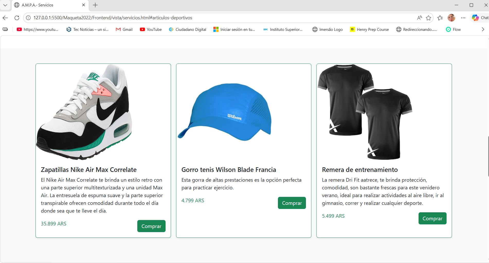
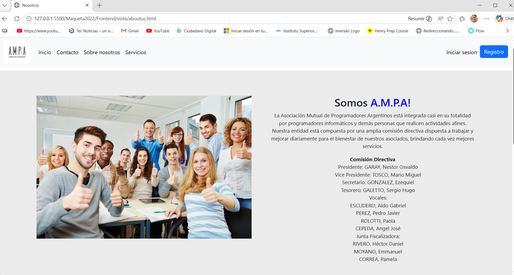

# 🏟️ Proyecto FullStack – Complejo Deportivo AMPA

Sistema web desarrollado como proyecto integrador del módulo FullStack (ISPC), orientado a la gestión de un complejo deportivo.

---

## 📌 Descripción

Aplicación web que permite a los usuarios:

- visualizar instalaciones deportivas
- explorar servicios disponibles
- navegar por distintas secciones del sitio

El proyecto fue desarrollado en equipo, simulando un entorno de trabajo real.

---

## 🧠 Rol y participación

Participé en el desarrollo del proyecto como parte de un equipo de trabajo, donde se dividieron responsabilidades entre los integrantes.

Mi enfoque principal estuvo en el diseño y modelado de la base de datos.  
Además, colaboré en distintas áreas del proyecto como:

- desarrollo frontend (HTML, CSS, JavaScript / TypeScript)
- integración de vistas
- maquetado visual
- organización del proyecto

Esta experiencia me permitió tener una visión general del sistema y comprender cómo se integran sus distintas partes.

---

## ⚙️ Funcionalidades principales

- 🏟️ Visualización de instalaciones
- 🛒 Sección tipo tienda
- 📄 Páginas informativas
- 🎨 Diseño web responsive básico

---

## 🛠️ Tecnologías utilizadas

- HTML5
- CSS3
- JavaScript
- TypeScript (Angular)
- Node.js

---

## 🗂️ Estructura del proyecto

```text
fullstack-sports-ecommerce/
├── BackEnd/
├── frontend/ampa/
├── Maqueta2022/
├── docs/
│   └── screenshots/
└── README.md


```

---

## 🖥️ Capturas del sistema

<p align="center">
  
  
</p>

<p align="center">
  
</p>
